## Instituição 
`ETEC Vasco Antônio Venchiarutti`

---

## Curso
`Informática para Internet`

---

## Turma
`2°D`

---

## Autores
- `Arthur Alexandre Dias Silva`
- `Helena Bianquini Carriço`

---

# Projeto 1 – Primeiro Aplicativo (pg. 27)

## Descrição
**Objetivo do aplicativo:**  
    O objetivo deste aplicativo é demonstrar, de forma simples, o funcionamento de eventos em aplicativos mobile. Ao interagir com um botão na interface, o usuário recebe uma mensagem de saudação. O projeto tem como finalidade introduzir conceitos básicos de programação em aplicativos, como interação com botões e exibição de mensagens na tela.

**Como ele funciona:**  
    O aplicativo possui um botão na interface principal. Sempre que o usuário clica nesse botão, o aplicativo executa um comando programado que exibe a mensagem "Olá mundo" na tela. Esse comportamento é controlado por blocos de programação que detectam o clique no botão e acionam a exibição da mensagem.

**Modificações ou melhorias em relação ao exemplo da apostila:**  
    Em relação ao exemplo apresentado na apostila, foram realizadas modificações na interface do aplicativo para torná-la mais organizada e visualmente agradável. Para isso, foram utilizados sistemas de organização horizontal, permitindo um melhor alinhamento dos elementos na tela e uma apresentação mais clara para o usuário. Essas alterações não modificam o funcionamento principal do aplicativo, mas melhoram sua aparência e usabilidade.

---

## Print das telas do Design
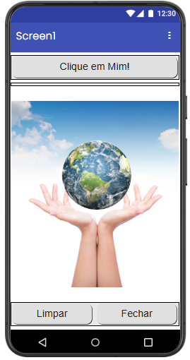

---

## Print das telas dos Blocos

---

# Projeto 2 – Segundo Aplicativo (pg. 46)

## Descrição
**Objetivo do aplicativo:**  
    O objetivo deste aplicativo é permitir que o usuário desenhe na tela utilizando diferentes cores. O projeto foi desenvolvido para demonstrar conceitos de interação com múltiplos botões e manipulação de elementos gráficos na tela, permitindo que o usuário escolha diferentes opções de cor para realizar desenhos.

**Funcionamento:**  
    O aplicativo possui quatro botões, cada um representando uma cor diferente de pincel. Quando o usuário seleciona um desses botões, o pincel passa a desenhar na tela utilizando a cor correspondente. Assim, o usuário pode desenhar livremente na área disponível. Além disso, na parte inferior da tela há um botão responsável por limpar o desenho, apagando tudo que foi feito e permitindo que o usuário comece novamente.

**Alterações feitas em relação à apostila:**  
    Em relação ao exemplo apresentado na apostila, foram realizadas algumas modificações na interface do aplicativo com o objetivo de melhorar sua estética e organização. Foram utilizadas organizações horizontais para alinhar melhor os botões na tela, deixando o layout mais estruturado e agradável visualmente. Também foi alterada a imagem de fundo do aplicativo para a imagem de um quadro, tornando o visual mais coerente com a proposta do aplicativo, que é desenhar na tela.

---

## Print das telas do Design

---

## Print das telas dos Blocos
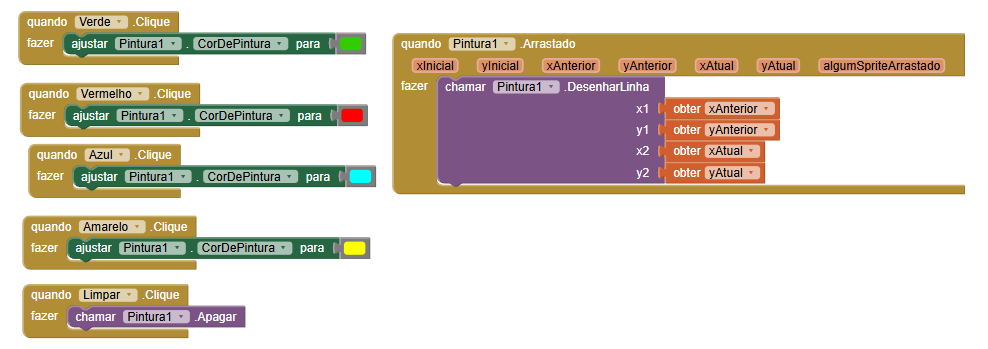

---

# Projeto 3 – Terceiro Aplicativo (pg. 56)

## 📖 Descrição
**Objetivo:**  
    O objetivo deste aplicativo é demonstrar o uso de recursos do dispositivo móvel, como vibração e reprodução de sons. A proposta do projeto é criar uma interação simples e divertida, onde o usuário pode simular o funcionamento de um liquidificador ao tocar na imagem exibida na tela.

**Funcionamento:**  
    O aplicativo apresenta, no centro da tela, a imagem de um liquidificador. Quando o usuário clica nessa imagem, o aplicativo executa duas ações simultaneamente: o celular começa a vibrar e um som de liquidificador é reproduzido, simulando o funcionamento do aparelho. Além disso, na parte inferior da tela há um botão que permite ao usuário encerrar e sair da aplicação.

**Modificações realizadas:**  
    Em relação ao exemplo apresentado na apostila, foram realizadas algumas alterações na interface do aplicativo para melhorar a organização dos elementos na tela. Para isso, foram utilizadas organizações horizontais, deixando o layout mais alinhado e visualmente mais agradável. Também foi realizada uma modificação na programação da vibração do dispositivo, aumentando sua duração de 3000 milissegundos para 5000 milissegundos, tornando o efeito mais perceptível durante a interação.

---

## Print das telas do Design

---

## Print das telas dos Blocos

---

# Projeto 4 – Quarto Aplicativo (pg. 64)

## Descrição
**Objetivo:**  
    O objetivo deste aplicativo é demonstrar a utilização da câmera do celular dentro de um aplicativo. A proposta do projeto é permitir que o usuário tire uma foto utilizando o próprio dispositivo e visualize essa imagem diretamente na tela do aplicativo.

**Funcionamento:**  
    O aplicativo possui um botão que permite ao usuário abrir a câmera do celular e tirar uma foto. Após a captura, a imagem tirada é exibida na tela principal do aplicativo, permitindo que o usuário visualize o resultado da foto. Além disso, na parte inferior da interface há um botão que permite encerrar e sair da aplicação.

**Modificações realizadas:**  
    Em relação ao exemplo apresentado na apostila, foram realizadas alterações na interface para melhorar a organização e o visual do aplicativo. Os botões foram organizados utilizando estruturas horizontais e receberam cores diferentes, tornando a interface mais clara e agradável para o usuário. Também foi adicionada uma funcionalidade extra: após tirar a foto, o aplicativo exibe um texto na tela comentando que a foto ficou boa, adicionando um pequeno feedback ao usuário após a captura da imagem.

---

## Print das telas do Design
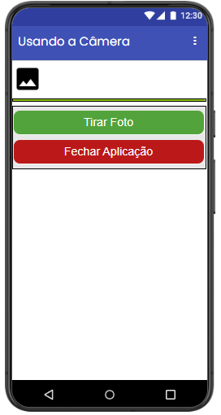

---

## Print das telas dos Blocos
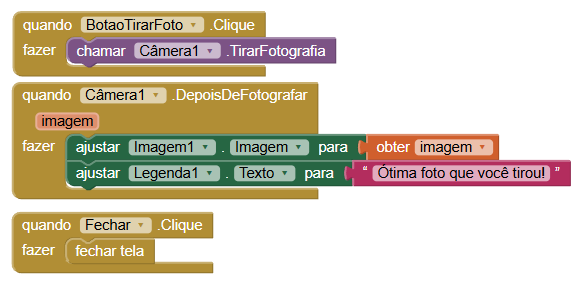

---

# Projeto 5 – Quinto Aplicativo (pg. 69)

## Descrição
**Objetivo:**  
     objetivo deste aplicativo é demonstrar o uso de múltiplas telas dentro de um mesmo projeto, permitindo a navegação entre diferentes partes do aplicativo. A proposta é apresentar como um aplicativo pode organizar diferentes funcionalidades em telas separadas, melhorando a estrutura e a experiência do usuário.

**Funcionamento:**  
    O aplicativo possui uma tela inicial que apresenta dois botões principais. Ao clicar em cada um deles, o usuário é direcionado para uma das duas telas disponíveis no aplicativo. Cada uma dessas telas também possui botões que permitem retornar ou navegar entre as outras telas do aplicativo.
Na Tela 1, foi implementada uma funcionalidade que permite fazer o celular vibrar quando o usuário interage com o aplicativo. Já na Tela 2, foi criado um pequeno soundboard, contendo quatro botões que reproduzem diferentes sons quando pressionados.

**Modificações realizadas:**  
    Em relação ao exemplo apresentado na apostila, foram realizadas diversas melhorias na interface do aplicativo, com o objetivo de deixá-la mais organizada e visualmente mais agradável. Foram feitas mudanças no estilo dos botões, nos fundos das telas e nos textos exibidos. Também foi adicionada uma imagem na tela inicial para melhorar a apresentação do aplicativo. Além disso, foram implementadas novas funcionalidades nas telas secundárias: a Tela 1 passou a ter um recurso de vibração do celular, enquanto a Tela 2 recebeu um soundboard com quatro sons diferentes, ampliando as possibilidades de interação do aplicativo.

---

## Print das telas do Design
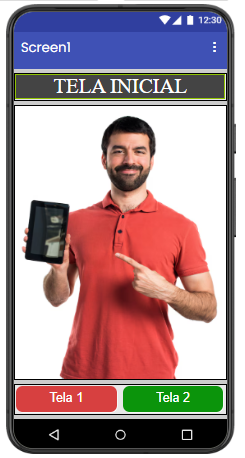
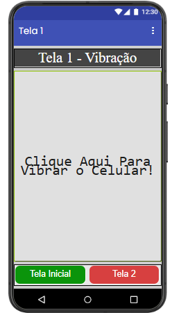
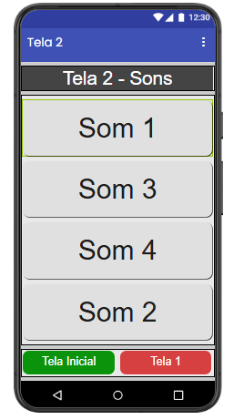

---

## Print das telas dos Blocos
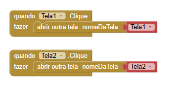
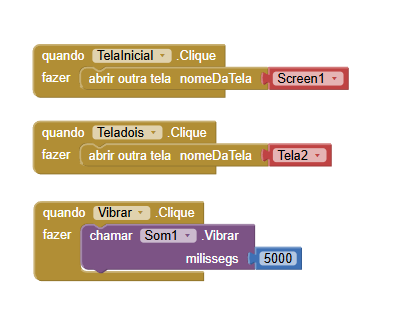
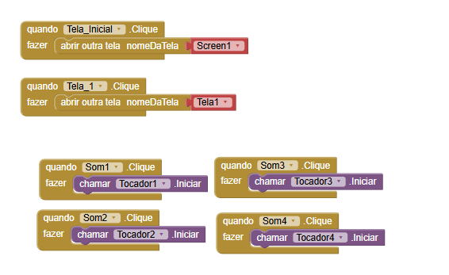

---

# Projeto 6 – Sexto Aplicativo (pg. 82)

## Descrição
**Objetivo:**  
    O objetivo deste aplicativo é demonstrar o uso de entrada de dados pelo teclado do celular dentro de um aplicativo. A proposta é permitir que o usuário digite seu nome e receba uma mensagem personalizada, mostrando como as informações inseridas pelo usuário podem ser utilizadas pelo aplicativo.

**Funcionamento:**  
    O aplicativo possui um campo de texto onde o usuário pode digitar seu nome utilizando o teclado do celular. Após inserir o nome e confirmar a ação, o aplicativo exibe uma mensagem na tela que inclui o nome digitado pelo usuário, criando uma resposta personalizada. Dessa forma, o aplicativo demonstra como capturar e utilizar dados fornecidos pelo usuário durante a execução.

**Modificações realizadas:**  
    Em relação ao exemplo apresentado na apostila, foram feitas algumas alterações na interface e na funcionalidade do aplicativo. A cor dos botões foi modificada para melhorar o visual e tornar a interface mais agradável. Além disso, foi implementada uma nova opção que permite ao usuário digitar também a sua cidade. Essa informação é exibida juntamente com o nome na mensagem final, tornando a resposta do aplicativo ainda mais personalizada.

---

## Print das telas do Design
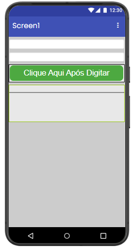

---

## Print das telas dos Blocos
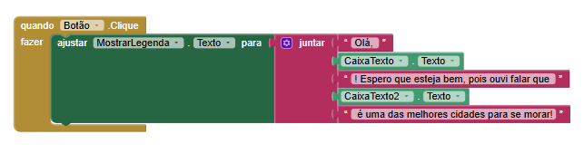

---

*Repositório criado para fins educacionais no curso de Informática para Internet.*
