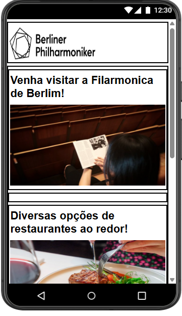
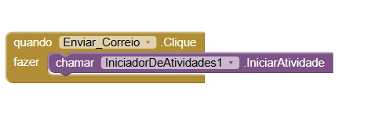
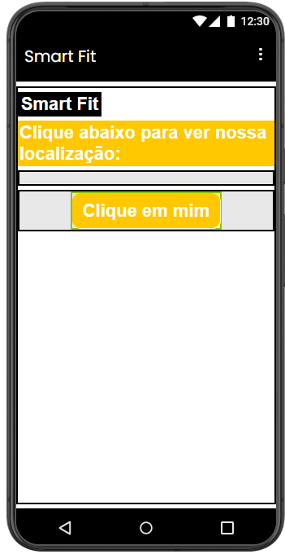
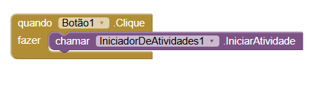
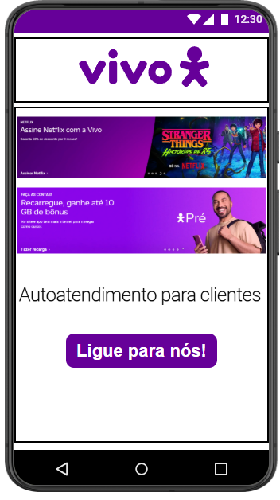
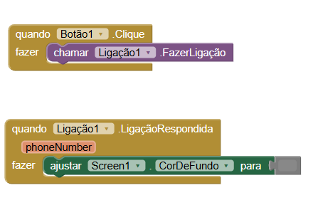

## Instituição

`ETEC Vasco Antônio Venchiarutti`

---

## Curso

`Informática para Internet`

---

## Turma

`2°D`

---

## Autores

* `Alex dos Santos Apolinario`
* `Ana Carolina Bernal Santos`

---

# Projeto 1 – Primeiro Aplicativo

## Descrição

**Objetivo do aplicativo:**
O objetivo deste aplicativo é permitir que o usuário acesse rapidamente diferentes sites de compras por meio de botões interativos. O projeto demonstra o uso de múltiplos botões e redirecionamento para links externos dentro de um aplicativo mobile.

**Funcionamento:**
O aplicativo apresenta diversos botões na interface principal, sendo que cada botão está vinculado a um link diferente. Ao clicar em um botão, o usuário é automaticamente redirecionado para o site correspondente utilizando o navegador do dispositivo.

**Modificações realizadas:**
Em relação ao modelo básico de um único botão, foram adicionados vários botões, cada um com um link distinto. Além disso, a interface foi organizada de forma a simular um aplicativo de compras, com melhor distribuição visual dos elementos.

---

## Print das telas do Design

## Print das telas dos Blocos

---

# Projeto 2 – Segundo Aplicativo

## Descrição

**Objetivo do aplicativo:**
O objetivo deste aplicativo é permitir que o usuário envie um e-mail diretamente ao clicar em um botão. O projeto demonstra a integração com funcionalidades de comunicação do dispositivo.

**Funcionamento:**
O aplicativo possui um botão principal que, ao ser pressionado, abre o aplicativo de e-mail do dispositivo já com um destinatário, assunto e mensagem previamente definidos.

**Modificações realizadas:**
A interface foi adaptada com base na estética da Filarmônica de Berlim, utilizando elementos visuais mais sofisticados, cores escuras e organização minimalista. Essas alterações visam melhorar a aparência sem alterar a funcionalidade principal.

## Print das telas do Design

## Print das telas dos Blocos

---

# Projeto 3 – Terceiro Aplicativo

## Descrição

**Objetivo:**
O objetivo deste aplicativo é permitir que o usuário visualize uma localização específica diretamente no mapa ao clicar em um botão. O projeto demonstra o uso de integração com serviços de localização.

**Funcionamento:**
O aplicativo apresenta um botão que, ao ser clicado, abre o aplicativo de mapas do dispositivo, direcionando o usuário para uma localização específica previamente definida.

**Modificações realizadas:**
A interface foi inspirada no aplicativo da Smart Fit, com foco em um design moderno, uso de cores vibrantes e organização clara dos elementos. Essas alterações tornam o aplicativo mais atrativo visualmente.

---

## Print das telas do Design

## Print das telas dos Blocos

---

# Projeto 4 – Quarto Aplicativo

## Descrição

**Objetivo:**
O objetivo deste aplicativo é permitir que o usuário realize uma ligação telefônica diretamente pelo aplicativo. O projeto demonstra o uso de funcionalidades nativas do dispositivo relacionadas à comunicação.

**Funcionamento:**
O aplicativo possui um botão que, ao ser pressionado, inicia uma chamada telefônica para um número previamente definido.

**Modificações realizadas:**
A interface foi baseada no aplicativo da Vivo, incluindo elementos visuais como cores características e inserção de áreas simulando propagandas. Essas modificações deixam o aplicativo mais próximo de um produto real de mercado.

## Print das telas do Design

## Print das telas dos Blocos

---

*Relatório desenvolvido para fins educacionais no curso de Informática para Internet.*
