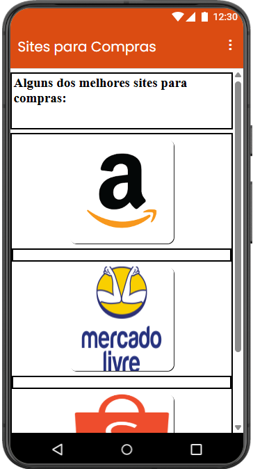
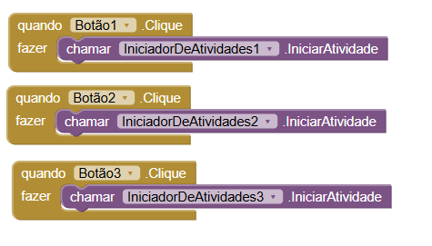

## Instituição

`ETEC Vasco Antônio Venchiarutti`

---

## Curso

`Informática para Internet`

---

## Turma

`2°D`

---

## Autores

* `Alex dos Santos Apolinario`
* `Ana Carolina Bernal Santos`

---

## Print das telas do Design

---

## Print das telas dos Blocos

---

# Projeto 3 – Terceiro Aplicativo

## Descrição

**Objetivo:**
O objetivo deste aplicativo é permitir que o usuário visualize uma localização específica diretamente no mapa ao clicar em um botão. O projeto demonstra o uso de integração com serviços de localização.

**Funcionamento:**
O aplicativo apresenta um botão que, ao ser clicado, abre o aplicativo de mapas do dispositivo, direcionando o usuário para uma localização específica previamente definida.

**Modificações realizadas:**
A interface foi inspirada no aplicativo da Smart Fit, com foco em um design moderno, uso de cores vibrantes e organização clara dos elementos. Essas alterações tornam o aplicativo mais atrativo visualmente.

---

## Print das telas do Design

---

## Print das telas dos Blocos

---

