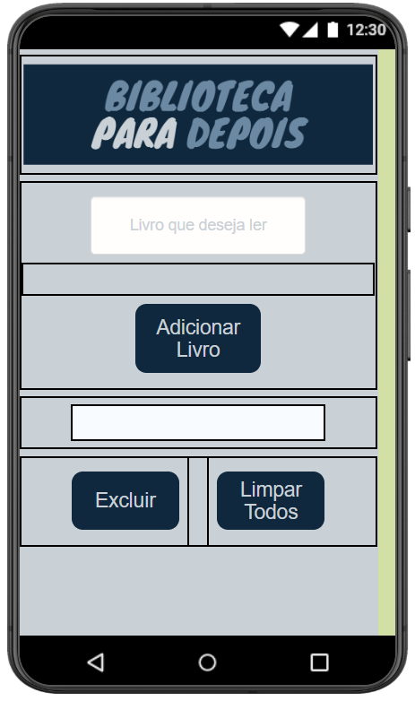
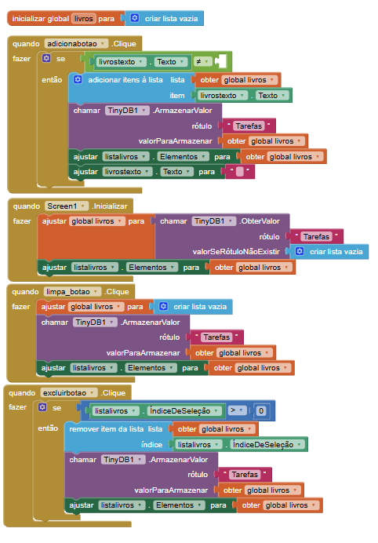

## Instituição

`ETEC Vasco Antônio Venchiarutti`

---

## Curso

`Informática para Internet`

---

## Turma

`2°D`

---

## Autores

* `Alex Apolinario dos Santos`
* `Ana Carolina Bernal Santos`

---

# Projeto – Biblioteca Para Depois

## Objetivo do aplicativo:

O objetivo deste aplicativo é permitir que o usuário mantenha uma lista de livros que deseja ler futuramente, de forma simples e organizada.

## Funcionamento:

O aplicativo possui apenas uma tela. Nela, o usuário pode digitar o nome de um livro em um campo de texto e adicioná-lo à lista de leitura.

Os livros adicionados são exibidos imediatamente na tela, permitindo visualizar facilmente as próximas leituras.

Além disso, o aplicativo oferece:
* Exclusão individual de um livro por meio de um botão ao lado de cada item;
* Exclusão completa da lista utilizando um botão para remover todos os livros cadastrados.

---

## Print da tela do Design

## Print da tela dos Blocos

---

*Relatório desenvolvido para fins educacionais no curso de Informática para Internet.*
