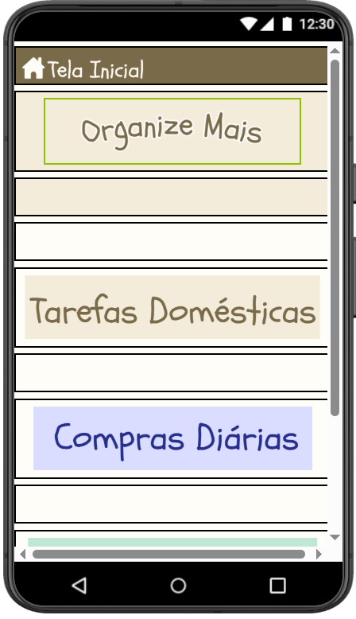
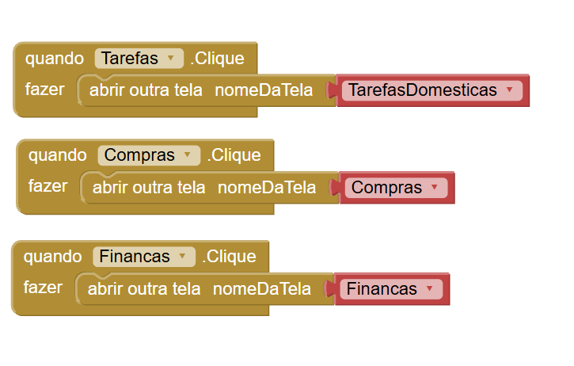
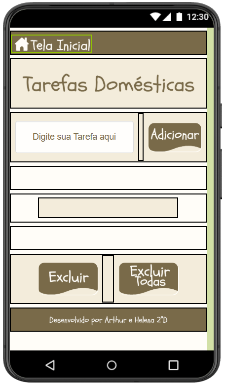
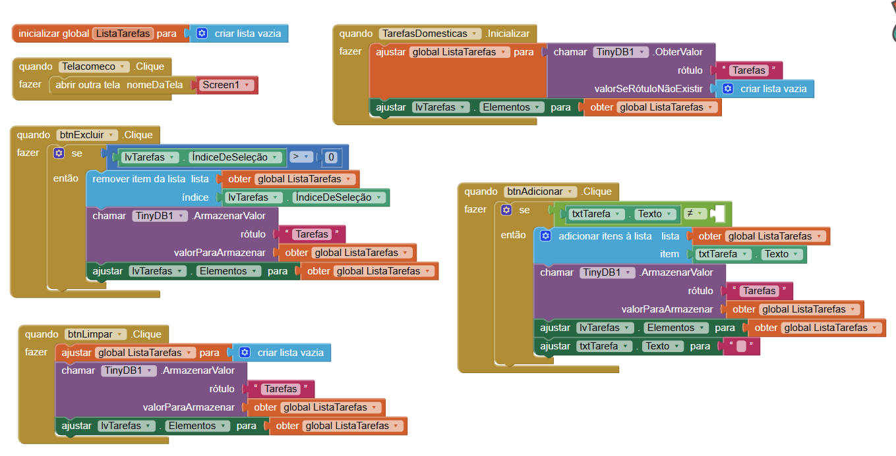
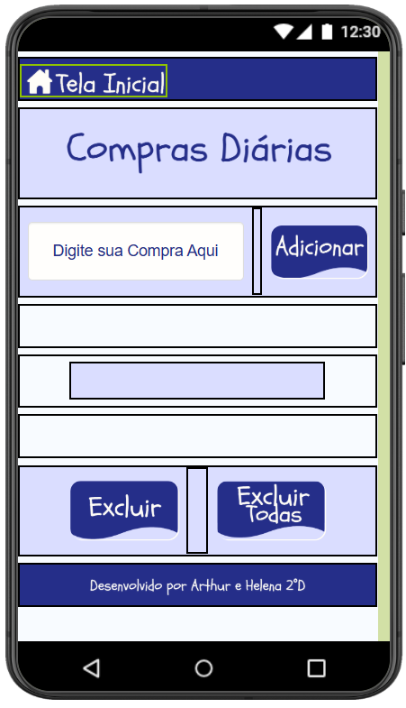
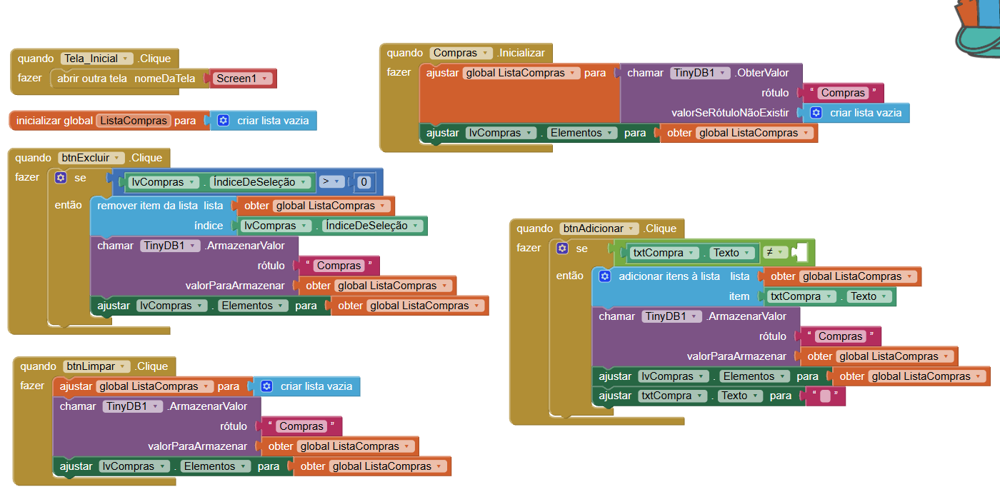
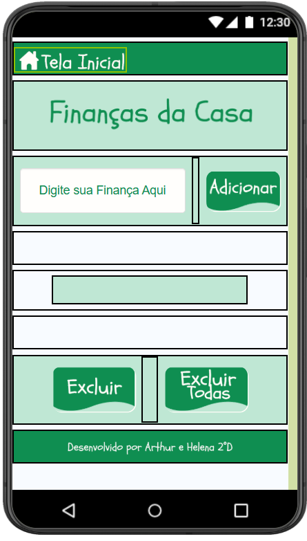
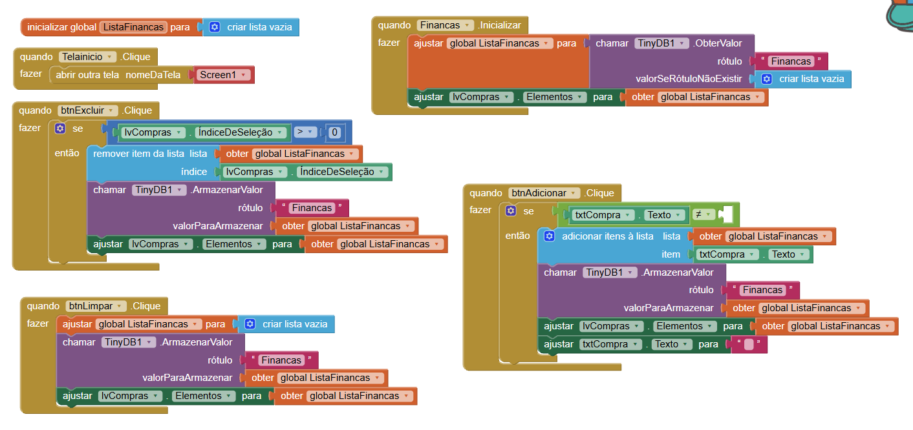

## Instituição

`ETEC Vasco Antônio Venchiarutti`

---

## Curso

`Informática para Internet`

---

## Turma

`2°D`

---

## Autores

* `Arthur Alexandre Dias Silva`
* `Helena Bianquini Carriço`

---

# Projeto – Aplicativo Organizador de Tarefas

## Objetivo do aplicativo:

O objetivo deste aplicativo é auxiliar o usuário na organização de suas tarefas diárias por meio de listas separadas por categorias, proporcionando uma forma simples e prática de registrar atividades e acompanhar suas pendências.

## Funcionamento:

O aplicativo possui uma tela inicial que permite acessar diferentes categorias de organização: **Tarefas Domésticas**, **Compras** e **Finanças**.

Em cada uma dessas seções, o usuário pode digitar uma nova tarefa em um campo de texto e adicioná-la à lista correspondente. As tarefas inseridas são exibidas imediatamente na tela, permitindo um gerenciamento rápido e intuitivo.

Além disso, o aplicativo oferece duas formas de remoção das tarefas cadastradas:

* Exclusão individual de uma tarefa por meio de um botão específico ao lado de cada item;
* Exclusão completa da lista da categoria utilizando um botão dedicado para remover todas as tarefas de uma única vez.

---
## Print das telas do Design da Primeira Tela

## Print das telas dos Blocos da Primeira Tela

## Print das telas do Design da Segunda Tela

## Print das telas dos Blocos da Segunda Tela

## Print das telas do Design da Terceira Tela

## Print das telas dos Blocos da Terceira Tela

## Print das telas do Design da Quarta Tela

## Print das telas dos Blocos da Quarta Tela

---

*Relatório desenvolvido para fins educacionais no curso de Informática para Internet.*
