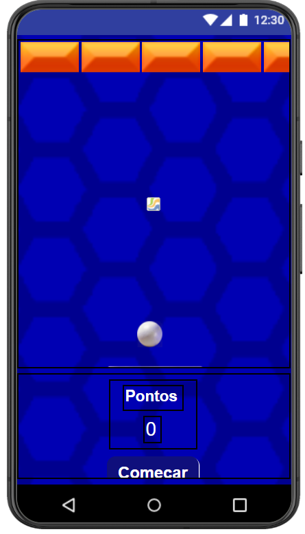
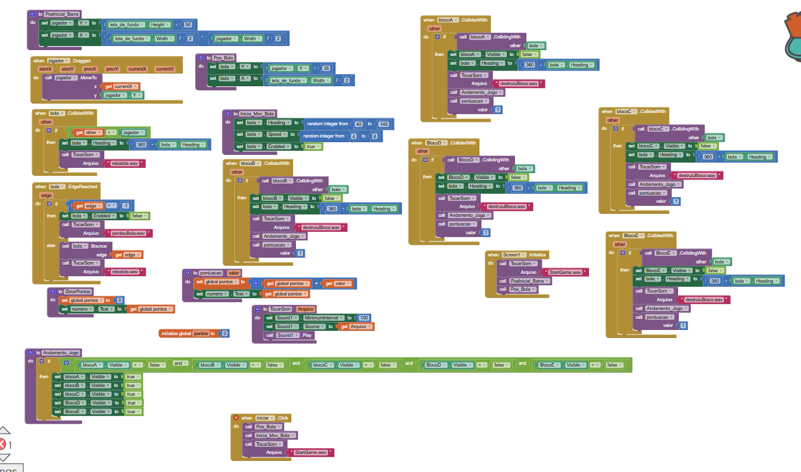

## Instituição

`ETEC Vasco Antônio Venchiarutti`

---

## Curso

`Informática para Internet`

---

## Disciplina

`DDM – Desenvolvimento para Dispositivos Móveis`

---

## Turma

`2°D`

---

## Autores

* `Alex Apolinario dos Santos`
* `Ana Carolina Bernal Santos`

---

# Relatório – Desenvolvimento de Jogos no MIT App Inventor

## Objetivo

O objetivo deste trabalho foi desenvolver e personalizar três jogos utilizando o MIT App Inventor, aplicando conceitos de programação por blocos, lógica de jogos, desenvolvimento de interfaces gráficas e utilização de componentes do dispositivo móvel.

---

# Projeto 1 – Brick Breaker / Pong

## Objetivo do jogo

O jogo consiste em controlar uma barra para impedir que a bola saia da tela, rebatendo-a continuamente. O objetivo é manter a bola em movimento pelo maior tempo possível.

## Modificações realizadas

Foi realizada a personalização da interface do jogo, tornando-a mais organizada, agradável visualmente e facilitando a interação do usuário durante a partida.

---

## Print do Design

## Print dos Blocos

---
