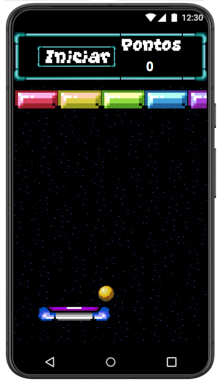
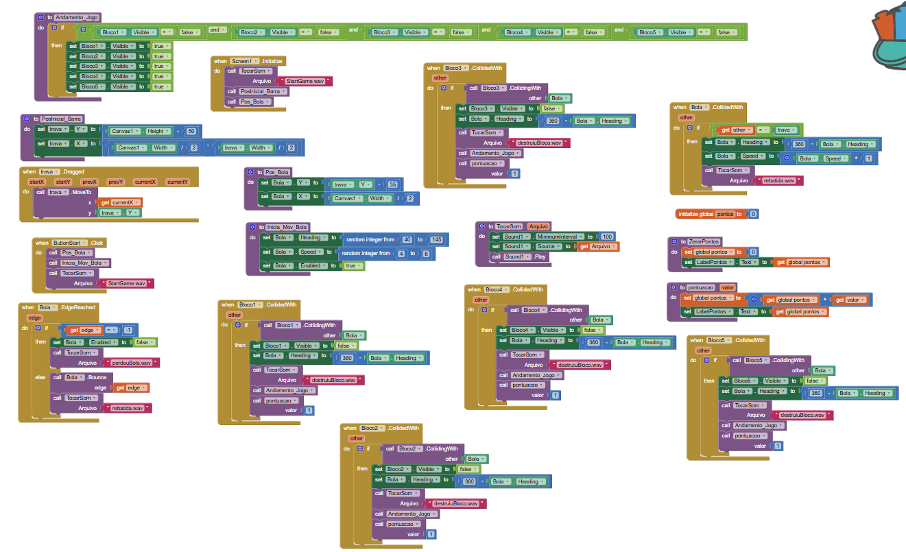

## Instituição

`ETEC Vasco Antônio Venchiarutti`

---

## Curso

`Informática para Internet`

---

## Disciplina

`DDM – Desenvolvimento para Dispositivos Móveis`

---

## Turma

`2°D`

---

## Autores

* `Arthur Alexandre Dias Silva`
* `Helena Bianquini Carriço`

---

# Relatório – Desenvolvimento de Jogos no MIT App Inventor

## Objetivo

O objetivo deste trabalho foi desenvolver e personalizar três jogos utilizando o MIT App Inventor, aplicando conceitos de programação por blocos, lógica de desenvolvimento de jogos, interface gráfica e utilização de recursos presentes em dispositivos móveis, como o acelerômetro.

---

# Projeto 1 – Brick Breaker / Pong

## Objetivo do jogo

O jogo consiste em controlar uma barra para impedir que a bola saia da tela, rebatendo-a continuamente. O desafio é manter a bola em movimento pelo maior tempo possível.

## Modificações realizadas

Durante o desenvolvimento foram implementadas diversas melhorias em relação ao projeto original:

- Criação de um novo design para o jogo;
- Desenvolvimento de uma interface mais organizada e agradável ao usuário;
- Implementação de um sistema de dificuldade, fazendo com que a velocidade da bola aumente sempre que ela colide com a barra, tornando a partida progressivamente mais desafiadora.

---

## Print do Design

## Print dos Blocos

---

*Relatório desenvolvido para fins educacionais na disciplina de Desenvolvimento para Dispositivos Móveis (DDM), utilizando o MIT App Inventor.*
