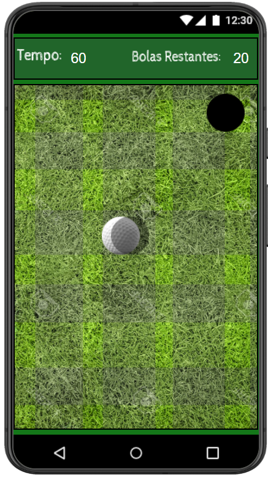
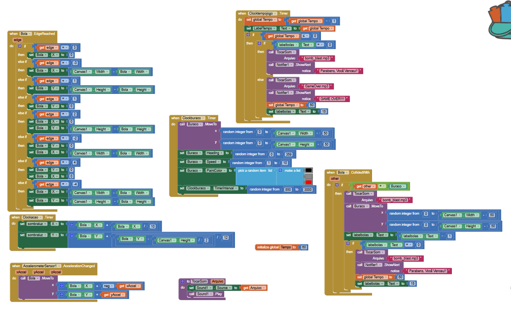
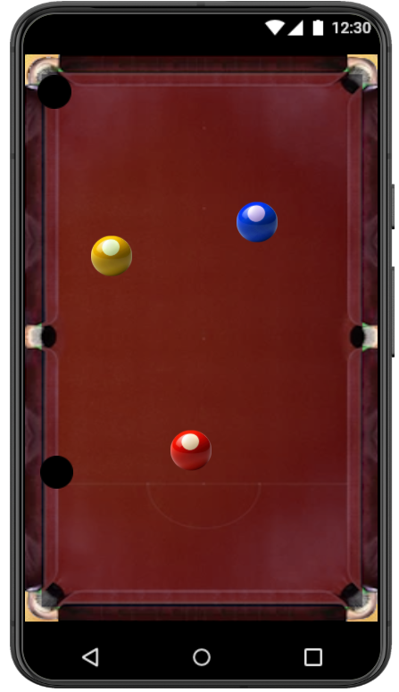
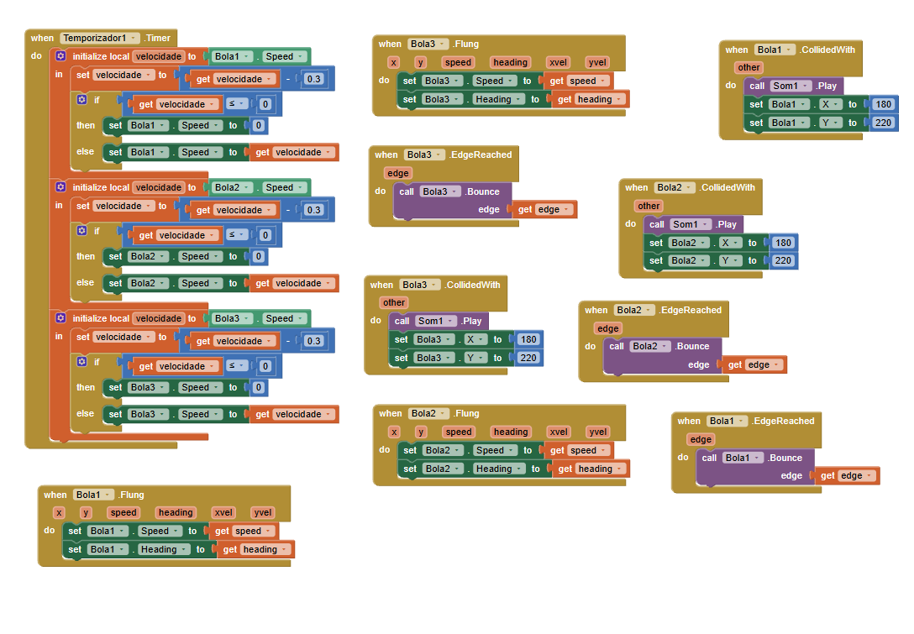

## Instituição

`ETEC Vasco Antônio Venchiarutti`

---

## Curso

`Informática para Internet`

---

## Disciplina

`DDM – Desenvolvimento para Dispositivos Móveis`

---

## Turma

`2°D`

---

## Autores

* `Arthur Alexandre Dias Silva`
* `Helena Bianquini Carriço`

---

# Relatório – Desenvolvimento de Jogos no MIT App Inventor

## Objetivo

O objetivo deste trabalho foi desenvolver e personalizar três jogos utilizando o MIT App Inventor, aplicando conceitos de programação por blocos, lógica de desenvolvimento de jogos, interface gráfica e utilização de recursos presentes em dispositivos móveis, como o acelerômetro.

---

# Projeto 1 – Brick Breaker / Pong

## Objetivo do jogo

O jogo consiste em controlar uma barra para impedir que a bola saia da tela, rebatendo-a continuamente. O desafio é manter a bola em movimento pelo maior tempo possível.

## Modificações realizadas

Durante o desenvolvimento foram implementadas diversas melhorias em relação ao projeto original:

- Criação de um novo design para o jogo;
- Desenvolvimento de uma interface mais organizada e agradável ao usuário;
- Implementação de um sistema de dificuldade, fazendo com que a velocidade da bola aumente sempre que ela colide com a barra, tornando a partida progressivamente mais desafiadora.

---

## Print do Design

## Print dos Blocos

---

# Projeto 2 – MagicBall com Acelerômetro

## Objetivo do jogo

Neste jogo, o jogador utiliza o acelerômetro do celular para movimentar uma bola inclinando o aparelho. O objetivo é conduzir a bola até um buraco para completar a fase.

## Modificações realizadas

Foram realizadas as seguintes melhorias:

- Desenvolvimento de um novo design para o cenário;
- Criação de uma interface mais intuitiva;
- Implementação de um sistema onde o buraco muda de cor aleatoriamente sempre que uma nova rodada inicia, tornando o jogo mais dinâmico visualmente.

---

## Print do Design

## Print dos Blocos

---

# Projeto 3 – Sinuca com Gravidade Simulada

## Objetivo do jogo

O jogo simula uma mesa de sinuca em que o jogador utiliza a inclinação do celular para movimentar as bolas através da gravidade simulada. O objetivo é encaçapar todas as bolas.

## Modificações realizadas

As principais alterações realizadas foram:

- Criação de uma nova interface para o jogo;
- Desenvolvimento de um design personalizado para a mesa e seus elementos;
- Alteração da mecânica do jogo para utilizar três bolas simultaneamente em vez de apenas uma, aumentando o nível de desafio e exigindo maior controle do jogador.

---

## Print do Design

## Print dos Blocos

---

# Considerações Finais

Os três projetos possibilitaram a aplicação prática dos conceitos estudados na disciplina de Desenvolvimento para Dispositivos Móveis (DDM), envolvendo programação por blocos, manipulação de componentes visuais, utilização de sensores do dispositivo e implementação de mecânicas de jogos. As modificações realizadas em cada projeto contribuíram para tornar os jogos mais completos, desafiadores e visualmente mais atrativos.

---

*Relatório desenvolvido para fins educacionais na disciplina de Desenvolvimento para Dispositivos Móveis (DDM), utilizando o MIT App Inventor.*
