## Instituição 
`ETEC Vasco Antônio Venchiarutti`

---

## Curso
`Informática para Internet`

---

## Turma
`2°D`

---

## Autores
- `Alex dos Santos Apolinario`
- `Ana Carolina Bernal Santos`

---

# Projeto 1 – Primeiro Aplicativo (pg. 27)

## Descrição
**Objetivo do aplicativo:**  
    O objetivo deste aplicativo é demonstrar, de forma simples, o funcionamento de eventos em aplicativos mobile. Ao interagir com um botão na interface, o usuário recebe uma mensagem de saudação. O projeto tem como finalidade introduzir conceitos básicos de programação em aplicativos, como interação com botões e exibição de mensagens na tela.

**Como ele funciona:**  
    O aplicativo possui um botão na interface principal. Sempre que o usuário clica nesse botão, o aplicativo executa um comando programado que exibe a mensagem "Olá mundo" na tela. Esse comportamento é controlado por blocos de programação que detectam o clique no botão e acionam a exibição da mensagem.

**Modificações ou melhorias em relação ao exemplo da apostila:**  
    Em relação ao exemplo apresentado na apostila, foram realizadas modificações na interface do aplicativo para torná-la mais organizada e visualmente agradável. Para isso, foram utilizados sistemas de organização horizontal, permitindo um melhor alinhamento dos elementos na tela e uma apresentação mais clara para o usuário, além também da mudança da imagem apresentada.

---

## Print das telas do Design
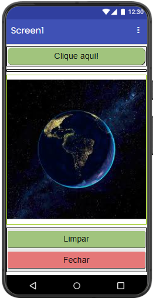

---

## Print das telas dos Blocos
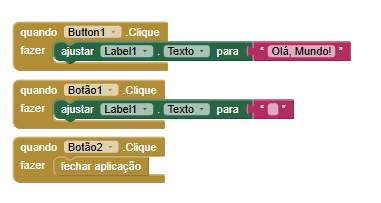

---

# Projeto 4 – Quarto Aplicativo (pg. 64)

## Descrição
**Objetivo:**  
    O objetivo deste aplicativo é demonstrar a utilização da câmera do celular dentro de um aplicativo. A proposta do projeto é permitir que o usuário tire uma foto utilizando o próprio dispositivo e visualize essa imagem diretamente na tela do aplicativo.

**Funcionamento:**  
    O aplicativo possui um botão que permite ao usuário abrir a câmera do celular e tirar uma foto. Após a captura, a imagem tirada é exibida na tela principal do aplicativo, permitindo que o usuário visualize o resultado da foto. Além disso, na parte inferior da interface há um botão que permite encerrar e sair da aplicação.

**Modificações realizadas:**  
    Em relação ao exemplo apresentado na apostila, foram realizadas alterações na interface para melhorar a organização e o visual do aplicativo. Os botões foram organizados utilizando estruturas horizontais e receberam cores diferentes, tornando a interface mais clara e agradável para o usuário.

---

## Print das telas do Design
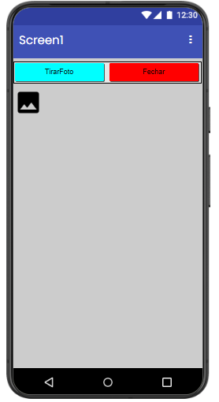

---

## Print das telas dos Blocos
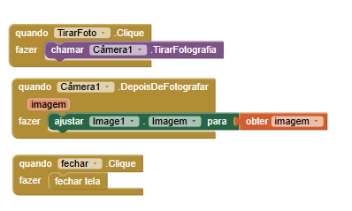

---
# Projeto 5 – Quinto Aplicativo (pg. 69)

## Descrição
**Objetivo:**  
     objetivo deste aplicativo é demonstrar o uso de múltiplas telas dentro de um mesmo projeto, permitindo a navegação entre diferentes partes do aplicativo. A proposta é apresentar como um aplicativo pode organizar diferentes funcionalidades em telas separadas, melhorando a estrutura e a experiência do usuário.

**Funcionamento:**  
    O aplicativo possui uma tela inicial que apresenta dois botões principais. Ao clicar em cada um deles, o usuário é direcionado para uma das duas telas disponíveis no aplicativo. Cada uma dessas telas também possui botões que permitem retornar ou navegar entre as outras telas do aplicativo.

**Modificações realizadas:**  
    Em relação ao exemplo apresentado na apostila, foram realizadas diversas melhorias na interface do aplicativo, com o objetivo de deixá-la mais organizada e visualmente mais agradável. Foram feitas mudanças no estilo dos botões, nos fundos das telas e nos textos exibidos. Também foi adicionada uma imagem na tela 2 para melhorar a apresentação do aplicativo e apresentar o usuário ao curso. 

---
## Print das telas do Design
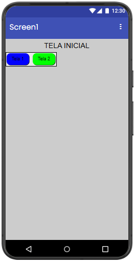
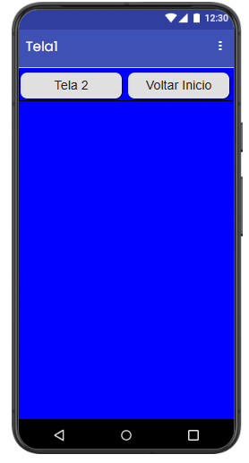
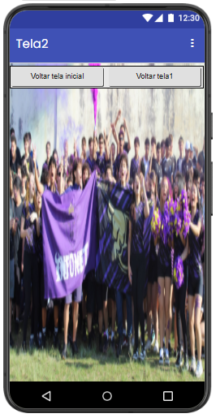

---

## Print das telas dos Blocos
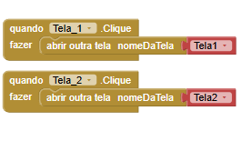
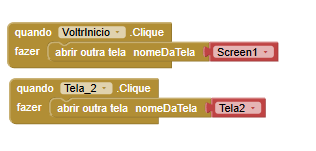
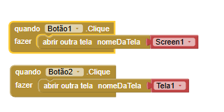

---

# Projeto 6 – Sexto Aplicativo (pg. 82)

## Descrição
**Objetivo:**  
    O objetivo deste aplicativo é demonstrar o uso de entrada de dados pelo teclado do celular dentro de um aplicativo. A proposta é permitir que o usuário digite seu nome e receba uma mensagem personalizada, mostrando como as informações inseridas pelo usuário podem ser utilizadas pelo aplicativo.

**Funcionamento:**  
    O aplicativo possui um campo de texto onde o usuário pode digitar seu nome utilizando o teclado do celular. Após inserir o nome e confirmar a ação, o aplicativo exibe uma mensagem na tela que inclui o nome digitado pelo usuário, criando uma resposta personalizada. Dessa forma, o aplicativo demonstra como capturar e utilizar dados fornecidos pelo usuário durante a execução.

**Modificações realizadas:**  
    Em relação ao exemplo apresentado na apostila, foram feitas algumas alterações na interface e na funcionalidade do aplicativo. A cor dos botões foi modificada para melhorar o visual e tornar a interface mais agradável.

---
## Print das telas do Design
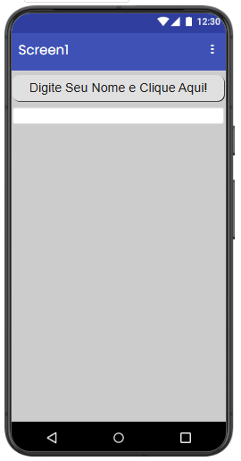

---

## Print das telas dos Blocos
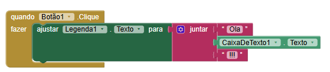

---

*Repositório criado para fins educacionais no curso de Informática para Internet.*