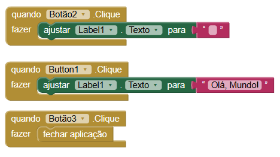
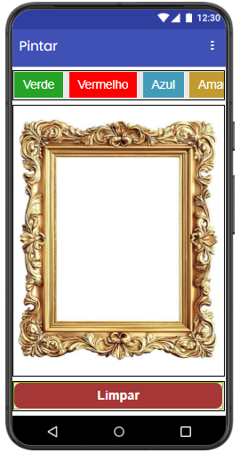
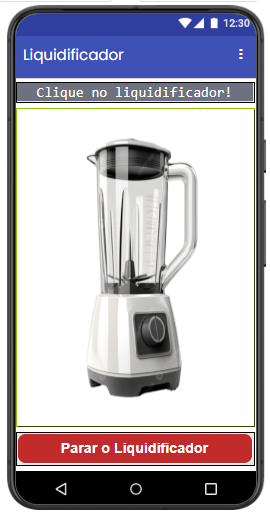
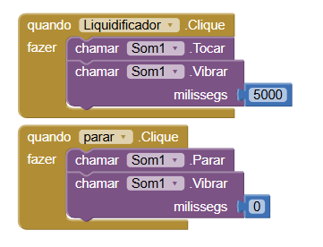

## Instituição 
`ETEC Vasco Antônio Venchiarutti`

---

## Curso
`Informática para Internet`

---

## Turma
`2°D`

---

## Autores
- `Arthur Alexandre Dias Silva`
- `Helena Bianquini Carriço`

---

# Projeto 1 – Primeiro Aplicativo (pg. 27)

## Descrição
**Objetivo do aplicativo:**  
O objetivo deste aplicativo é demonstrar, de forma simples, o funcionamento de eventos em aplicativos mobile. Ao interagir com um botão na interface, o usuário recebe uma mensagem de saudação. O projeto tem como finalidade introduzir conceitos básicos de programação em aplicativos, como interação com botões e exibição de mensagens na tela.

**Como ele funciona:**  
O aplicativo possui um botão na interface principal. Sempre que o usuário clica nesse botão, o aplicativo executa um comando programado que exibe a mensagem "Olá mundo" na tela. Esse comportamento é controlado por blocos de programação que detectam o clique no botão e acionam a exibição da mensagem.

**Modificações ou melhorias em relação ao exemplo da apostila:**  
Em relação ao exemplo apresentado na apostila, foram realizadas modificações na interface do aplicativo para torná-la mais organizada e visualmente agradável. Para isso, foram utilizados sistemas de organização horizontal, permitindo um melhor alinhamento dos elementos na tela e uma apresentação mais clara para o usuário. Essas alterações não modificam o funcionamento principal do aplicativo, mas melhoram sua aparência e usabilidade.

---

## Print das telas do Design

---

## Print das telas dos Blocos

---

# Projeto 2 – Segundo Aplicativo (pg. 46)

## Descrição
**Objetivo do aplicativo:**  
O objetivo deste aplicativo é permitir que o usuário desenhe na tela utilizando diferentes cores. O projeto foi desenvolvido para demonstrar conceitos de interação com múltiplos botões e manipulação de elementos gráficos na tela, permitindo que o usuário escolha diferentes opções de cor para realizar desenhos.

**Funcionamento:**  
O aplicativo possui quatro botões, cada um representando uma cor diferente de pincel. Quando o usuário seleciona um desses botões, o pincel passa a desenhar na tela utilizando a cor correspondente. Assim, o usuário pode desenhar livremente na área disponível. Além disso, na parte inferior da tela há um botão responsável por limpar o desenho, apagando tudo que foi feito e permitindo que o usuário comece novamente.

**Alterações feitas em relação à apostila:**  
Em relação ao exemplo apresentado na apostila, foram realizadas algumas modificações na interface do aplicativo com o objetivo de melhorar sua estética e organização. Foram utilizadas organizações horizontais para alinhar melhor os botões na tela, deixando o layout mais estruturado e agradável visualmente. Também foi alterada a imagem de fundo do aplicativo para a imagem de um quadro, tornando o visual mais coerente com a proposta do aplicativo, que é desenhar na tela.

---

## Print das telas do Design

---

## Print das telas dos Blocos

---

# Projeto 3 – Terceiro Aplicativo (pg. 56)

## 📖 Descrição
**Objetivo:**  
O objetivo deste aplicativo é demonstrar o uso de recursos do dispositivo móvel, como vibração e reprodução de sons. A proposta do projeto é criar uma interação simples e divertida, onde o usuário pode simular o funcionamento de um liquidificador ao tocar na imagem exibida na tela.

**Funcionamento:**  
O aplicativo apresenta, no centro da tela, a imagem de um liquidificador. Quando o usuário clica nessa imagem, o aplicativo executa duas ações simultaneamente: o celular começa a vibrar e um som de liquidificador é reproduzido, simulando o funcionamento do aparelho. Além disso, na parte inferior da tela há um botão que permite ao usuário encerrar e sair da aplicação.

**Modificações realizadas:**  
Em relação ao exemplo apresentado na apostila, foram realizadas algumas alterações na interface do aplicativo para melhorar a organização dos elementos na tela. Para isso, foram utilizadas organizações horizontais, deixando o layout mais alinhado e visualmente mais agradável. Também foi realizada uma modificação na programação da vibração do dispositivo, aumentando sua duração de 3000 milissegundos para 5000 milissegundos, tornando o efeito mais perceptível durante a interação.

---

## Print das telas do Design

---

## Print das telas dos Blocos

---

# 📌 Projeto 4 – Quarto Aplicativo (pg. 64)

## 📖 Descrição
**Objetivo:**  
`(descreva aqui)`

**Funcionamento:**  
`(descreva aqui)`

**Modificações realizadas:**  
`(descreva aqui)`

---

## 🎨 Print das telas do Design

---

## 🧩 Print das telas dos Blocos

---

# 📌 Projeto 5 – Quinto Aplicativo (pg. 69)

## 📖 Descrição
**Objetivo:**  
`(descreva aqui)`

**Funcionamento:**  
`(descreva aqui)`

**Modificações realizadas:**  
`(descreva aqui)`

---

## 🎨 Print das telas do Design

---

## 🧩 Print das telas dos Blocos

---

# 📌 Projeto 6 – Sexto Aplicativo (pg. 82)

## 📖 Descrição
**Objetivo:**  
`(descreva aqui)`

**Funcionamento:**  
`(descreva aqui)`

**Modificações realizadas:**  
`(descreva aqui)`

---

## 🎨 Print das telas do Design

---

## 🧩 Print das telas dos Blocos

---

⭐ *Repositório criado para fins educacionais.*
